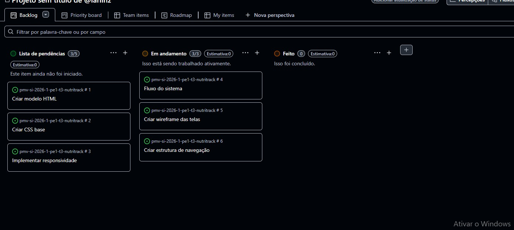

# NutriTrack

`CURSO: Sistemas de Informação`

`DISCIPLINA: Projeto - Aplicações Web`

`SEMESTRE: 1º`

O projeto **NutriTrack** consiste no desenvolvimento de um sistema web de contagem de calorias, voltado para auxiliar usuários no controle da alimentação diária. O sistema permite o registro de alimentos consumidos, cálculo aproximado de calorias e acompanhamento da ingestão ao longo do dia.

O sistema é direcionado a diferentes perfis de usuários, como estudantes, iniciantes em reeducação alimentar e praticantes de atividades físicas, oferecendo uma interface simples e intuitiva. Além disso, o projeto inclui requisitos funcionais e não funcionais, como cadastro de usuários, registro de alimentos, geração de relatórios e responsividade.

## Integrantes
Bel Antonio de Aquino e Souza
Iago Augusto Rocha de Paula Pereira
Larissa Evelyn Marques da Silva 
Matheus Ambrosio Almeida 
Tiago Marcio Oliveira Azevedo

## Orientador

Clovis Lemos Tavares

# Planejamento

| Etapa         | Atividades |
|  :----:   | ----------- |
| ETAPA 1         |[Documentação de Contexto](docs/context.md)   [Especificação do Projeto](docs/especification.md) |
| ETAPA 2         |[Projeto de Interface](docs/interface.md)   [Template Padrão](docs/template.md) |
| ETAPA 3         |[Programação de Funcionalidades - HTML e CSS](docs/development.md) |
| ETAPA 4        |[Programação de Funcionalidades - Javascript](docs/development.md)   [Testes de Software ](docs/tests.md) |
| ETAPA 5         | [Apresentação](presentation/README.md) |

# Código

<li><a href="src/README.md"> Código Fonte</a></li>

# Apresentação

O presente projeto tem como objetivo desenvolver um sistema web de contagem de calorias que auxilia os usuários no controle de sua alimentação diária. A proposta busca oferecer uma ferramenta que permita registrar os alimentos consumidos ao longo do dia e acompanhar a quantidade de calorias ingeridas, contribuindo para uma maior conscientização sobre os hábitos alimentares.

Além disso, o sistema pretende facilitar o acompanhamento da alimentação de forma prática e acessível, permitindo que os usuários tenham uma visão mais clara sobre sua ingestão calórica e possam tomar decisões mais conscientes em relação à sua dieta. Dessa forma, o projeto busca incentivar a adoção de hábitos alimentares mais saudáveis e contribuir para a melhoria da qualidade de vida das pessoas.

## Organização do Projeto (GitHub Projects - Kanban)

O projeto NutriTrack foi organizado utilizando o GitHub Projects no modelo Kanban.

O quadro foi dividido em três colunas:
- Pendência (tarefas a iniciar)
- Fazendo (tarefas em desenvolvimento)
- Feito (tarefas concluídas)

Essa organização permitiu acompanhar o progresso do desenvolvimento do sistema, facilitando o controle e a distribuição das atividades da equipe.

---

### 📸 Print do Kanban

